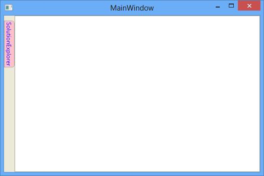

# How-to-customize-the-auto-hide-window-of-the-docking-manager
The side panel and side panel header can be customized by applying its Background, BorderBrush, BorderThickness and SidePanelSize through SidePanelBackground, SidePanelBorderBrush, SidePanelBorderThickness, SidePanelSize properties of the DockingManager.

# C#

    <syncfusion:DockingManager SidePanelBackground="Brown"
                           SidePanelBorderBrush="Yellow" SideItemsBackground="Green"
                           SidePanelBorderThickness="2,2,2,2" SideItemsBorderBrush="BlueViolet" SidePanelSize="40">

    <ContentControl syncfusion:DockingManager.Header="SolutionExplorer" syncfusion:DockingManager.State="AutoHidden" />
    </syncfusion:DockingManager>

## SideTabItem Customization
The SideTabItem can be customized using the attached properties SideTabItemForeground and SideTabItemBackground of DockingManager.

## C#

    <syncfusion:DockingManager.SideTabItemForeground="Blue" syncfusion:DockingManager.SideTabItemBackground="Pink"/>  

